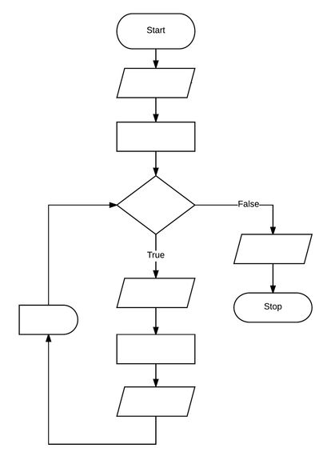

// [.text-center]
// = Image Bakery

++++
<h1 align="center">Image Bakery</h1>
    <h4 align="center"> Custom Image Creation Utility</h4>
++++

---

// [.float-group]
// --
// image::https://img.shields.io/badge/License-Apache%202.0-blue.svg"[Apache License, float="left"]
// image::https://gitlab.com/gacybercenter/image-bakery/badges/master/pipeline.svg[Pipeline Status, float="left"]
// image::https://img.shields.io/docker/cloud/build/gacybercenter/image-bakery[Docker Build, float="left"]
// image::https://img.shields.io/docker/pulls/gacybercenter/image-bakery.svg[Docker Pulls, float="left"]
// --

++++

    <a href="https://www.apache.org/licenses/LICENSE-2.0.txt">
    
    <a href="https://gitlab.com/gacybercenter/image-bakery/badges/master/pipeline.svg">
    
    <a href="https://hub.docker.com/r/gacybercenter/image-bakery/builds">
    
    <a href="https://hub.docker.com/r/gacybercenter/image-bakery">
    

  <a href="#user-content-basic-overview">Basic Overview</a> •
  <a href="#user-content-installation">Installation</a> •
  <a href="#user-content-usage">Usage</a> •
  <a href="#user-content-features">Features</a> •
  <a href="#user-content-contributing">Contributing</a> •
  <a href="#user-content-author">Author</a> •
  <a href="#user-content-license">License</a>

++++

// [.float-group]
// --
// image::https://img.shields.io/badge/License-Apache%202.0-blue.svg"[Apache License, float="left"]
// image::https://gitlab.com/gacybercenter/image-bakery/badges/master/pipeline.svg[Pipeline Status, float="left"]
// image::https://img.shields.io/docker/cloud/build/gacybercenter/image-bakery[Docker Build, float="left"]
// image::https://img.shields.io/docker/pulls/gacybercenter/image-bakery.svg[Docker Pulls, float="left"]
// --

== Basic Overview
Image Bakery is a image creation utility focused on creating reproducible images of several types to include VM, cloud images, docker, and direct to metal.

Image Bakery uses a combination of virt-builder, virt-customize, docker, minio, and other tools to achieve these goals.

The format for defining an image build is still unstable and very much a work in progress, so the ugly direct-to-ci hack is just being used for testing purposes until cli interface is fleshed out.

== Installation
=== Local Installation
Image Bakery can be installed locally without a CI/CD pipeline on any x86 64-bit Linux OS, provided the following requirements are met:

.Requirements
* Python3.8
* python3-pip
* npm
* libguestfs-tools

.Install requirements (Ubuntu 20.004):
----
apt-get install python3 python3-pip npm libguestfs-tools
----

.Pip package requirements
* https://pypi.org/project/PyYAML/[pyyaml] +
* https://pypi.org/project/requests/[requests] +
* https://pypi.org/project/tqdm/[tqdm] +
* https://pypi.org/project/minio/[minio] +

.Install pip package requirements:
----
pip3 install pyyaml requests tdm minio
----

.Clone the repository to a local directory:
----
git clone https://gitlab.com/gacybercenter/image-bakery.git
----

=== Docker Installation
.Requirements:
* Docker
* Git clone of image bakery repo

If docker installation instructions are needed, use the https://docs.docker.com/engine/install/[install guide] provided by the docker docs.

Image Bakery is designed with the flexibility to run on a CI/CD pipeline in or locally with docker containers, however additional configuration must be performed:

WARNING: The runner must expose `/dev/kvm` to the job for Image Bakery to work properly. Failure to do so will result in a painfully slow image building experience. This issue can be addressed by running the docker container in privileged mode and adding the runner job user to the kvm group. Custom runner TOML configuration is included for reference below.

.[red]#Click to expand sample toml configuration#
[%collapsible]
====
.config.toml Sample Configuration:
[source, toml]
----
[[runners]]
  ...
  [runners.custom_build_dir]
  [runners.cache]
    [runners.cache.s3]
    [runners.cache.gcs]
  [runners.docker]
    tls_verify = false
    image = "debian:latest"
    privileged = false
    devices = ["/dev/kvm"]
    disable_entrypoint_overwrite = false
    oom_kill_disable = false
    disable_cache = false
    volumes = ["/cache"]
    shm_size = 0
----
====

.Pull latest docker image from docker hub:
----
docker pull gacybercenter/image-bakery:latest
----

.Execute docker run for image bakery image:
----
sudo docker run --name=bake_test -d -v ~/image-bakery:/home/image-bakery --device /dev/kvm:/dev/kvm gacybercenter/image-bakery:latest /bin/bash
----

.[red]#Click to expand pseudo syntax for docker command referenced above#
[%collapsible]
====
.Pseudo syntax for the command above
----
sudo docker run --name=<container name> -d -v <host git path:container mnt path> --device <device to pass through>:<device name/path in container> <container image> <entrypoint>

-d (detached)
-v mount volume
----
====

.Enter a bash terminal on the image bakery container:
----
docker container exec -it bake_test /bin/bash
----

== Usage
Image bakery uses templates written in https://en.wikipedia.org/wiki/YAML[yaml] format for specification of image attributes. The configuration files that image-bakery uses to determine it's image build should be placed in `image_bakery/templates`. An example is provided below.

.[red]#Click to expand sampl yaml configuration#
[%collapsible]
====
.Sample ubuntu1804.yaml
[source, yaml]
----
---

image_name: ubuntu-18.04

compressed: false

convert: true

output_format: raw

compression: xz

method: virt-builder

packages:
    - pkg1
    - pkg2

customization: |
    #!/bin/bash
    echo "customization completed via virt-builder" > ./custom.txt

----
====

=== Local Usage:
.Navigate to the the cloned repo directory and run image_bake.py:
----
cd image-bakery
python3 image-bake.py <arg1> <arg2> <arg3> 

options:
arg1 - ip address and port number (ex. 172.10.0.1:9000) for minio object storage container (if not specified, image will be saved to the local image_bakery parent directory)

arg2 - AccessKeyID

arg3 - SecretAccessKey
----

=== Docker Usage:
.Enter a bash terminal on the image bakery container:
----
docker container exec -it bake_test /bin/bash

#Navigate to the cloned repo directory and run image_bake.py:
cd image-bakery
python3 image-bake.py <arg1> <arg2> <arg3> <arg4>
----

== Features
Cras elit magna, congue eget eros aliquet, efficitur ultrices metus. Ut et accumsan tortor. Maecenas mollis rhoncus erat sed tempus. Aliquam ut volutpat tellus. Sed at convallis mi. Cras pulvinar justo magna, eget sagittis arcu consequat sed. Suspendisse potenti. Mauris ex velit, auctor eget tristique ac, malesuada id nibh. Aenean porttitor scelerisque massa tincidunt iaculis. Suspendisse potenti. Pellentesque bibendum feugiat lacus. Proin sodales euismod viverra. Phasellus consequat euismod massa, vel imperdiet nulla consequat sed. Donec in quam sit amet tortor aliquet venenatis. Donec tellus neque, elementum ut magna eleifend, commodo laoreet justo. Proin neque risus, ultricies a lorem nec, pulvinar auctor neque.

Fusce ut sapien id nulla rutrum convallis. Class aptent taciti sociosqu ad litora torquent per conubia nostra, per inceptos himenaeos. Nunc at pellentesque lectus. Aenean ultricies nisl ex, a ultrices ipsum sollicitudin eu. Nam aliquet aliquam nulla, eget pharetra eros tristique eu. Sed dignissim, lorem in pellentesque finibus, urna mauris tempus tortor, vel consequat tortor ipsum vitae leo. Donec sollicitudin ligula in felis aliquet sagittis. Aenean consectetur ex in ante laoreet suscipit. Integer fringilla dolor quis mi tristique ultrices. Aenean nec vehicula est, at accumsan elit. Phasellus interdum pulvinar odio, nec maximus orci gravida sit amet. Nunc aliquam enim id ex euismod, eu tempor arcu egestas. Fusce aliquet nec ex at vestibulum. 

== How it works
Fusce ut sapien id nulla rutrum convallis. Class aptent taciti sociosqu ad litora torquent per conubia nostra, per inceptos himenaeos. Nunc at pellentesque lectus. Aenean ultricies nisl ex, a ultrices ipsum sollicitudin eu. Nam aliquet aliquam nulla, eget pharetra eros tristique eu. Sed dignissim, lorem in pellentesque finibus, urna mauris tempus tortor, vel consequat tortor ipsum vitae leo. Donec sollicitudin ligula in felis aliquet sagittis. Aenean consectetur ex in ante laoreet suscipit. Integer fringilla dolor quis mi tristique ultrices. Aenean nec vehicula est, at accumsan elit. Phasellus interdum pulvinar odio, nec maximus orci gravida sit amet. Nunc aliquam enim id ex euismod, eu tempor arcu egestas. Fusce aliquet nec ex at vestibulum. 

.Flowchart of program execution

== Contributing
Cras elit magna, congue eget eros aliquet, efficitur ultrices metus. Ut et accumsan tortor. Maecenas mollis rhoncus erat sed tempus. Aliquam ut volutpat tellus. Sed at convallis mi. Cras pulvinar justo magna, eget sagittis arcu consequat sed. Suspendisse potenti. Mauris ex velit, auctor eget tristique ac, malesuada id nibh. Aenean porttitor scelerisque massa tincidunt iaculis. Suspendisse potenti. Pellentesque bibendum feugiat lacus. Proin sodales euismod viverra. Phasellus consequat euismod massa, vel imperdiet nulla consequat sed. Donec in quam sit amet tortor aliquet venenatis. Donec tellus neque, elementum ut magna eleifend, commodo laoreet justo. Proin neque risus, ultricies a lorem nec, pulvinar auctor neque.

Fusce ut sapien id nulla rutrum convallis. Class aptent taciti sociosqu ad litora torquent per conubia nostra, per inceptos himenaeos. Nunc at pellentesque lectus. Aenean ultricies nisl ex, a ultrices ipsum sollicitudin eu. Nam aliquet aliquam nulla, eget pharetra eros tristique eu. Sed dignissim, lorem in pellentesque finibus, urna mauris tempus tortor, vel consequat tortor ipsum vitae leo. Donec sollicitudin ligula in felis aliquet sagittis. Aenean consectetur ex in ante laoreet suscipit. Integer fringilla dolor quis mi tristique ultrices. Aenean nec vehicula est, at accumsan elit. Phasellus interdum pulvinar odio, nec maximus orci gravida sit amet. Nunc aliquam enim id ex euismod, eu tempor arcu egestas. Fusce aliquet nec ex at vestibulum. 

== Future Improvements/Issues
https://gitlab.com/gacybercenter/image-bakery/-/issues[Image Bakery Current Issues]

.Improvements
* [ ] Documentation
** [ ] Basic Documentation
* [ ] CLI Interface
* [ ] Docker Image builder / Dockerfile publisher
* [ ] Various storage options (AWS, Swift Object Store, etc.)
* [ ] CI/CD Improvements
** [ ] Glance image store upload
* [ ] Windows Image Build

== Author
Email: alcantrell@augusta.edu

== License
image:https://img.shields.io/badge/License-Apache%202.0-blue.svg[link="https://www.apache.org/licenses/LICENSE-2.0.txt"]
